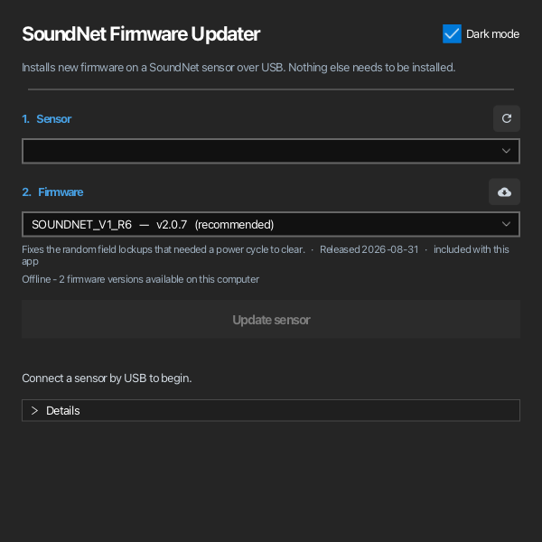

# SoundNet Sensor Firmware Updater

A desktop application that installs new firmware onto a SoundNet sensor over
USB. It exists so that updating a sensor in the field does not require the
Arduino IDE, board packages, libraries, or any knowledge of what a bootloader
is.

The researcher sees two drop-downs and a button.



Dark mode is the default; the toggle at the top right switches it and the
choice is remembered between runs.

## Where firmware comes from

Firmware is published in a separate repository,
[`sensor_firmware_binary`](https://github.com/Sound-Net/sensor_firmware_binary), and
the updater assembles its list from three places:

| Source | When it is used |
| --- | --- |
| **Bundled** — compiled into the application | Always. Currently 2.0.7 for `SOUNDNET_V1_R5` and `SOUNDNET_V1_R6`. This is the floor: the updater is never useless, even with no connection. |
| **Cached** — previously downloaded, kept in `~/.soundnet-firmware-updater/cache` | Offline, after the machine has been online at least once. |
| **Online** — the live `manifest.json` from the firmware repository | Fetched in the background at startup, so a slow or absent connection never delays the window. |

The offline list appears instantly; the online list replaces it a moment later
if the repository answers. Where the same build appears in more than one place,
the copy that needs no download wins. Builds that exist only online are marked
and downloaded when Update is pressed — then cached, so the next trip out needs
no signal.

Downloads are checked against the SHA-256 in the manifest and discarded if they
do not match, rather than written to a sensor.

**[docs/firmware-repository.md](docs/firmware-repository.md) is the contract**:
the repository layout, the manifest format, and how to publish.

## What it does to the sensor

The sensors are SparkFun Pro Micro boards (ATmega32U4) running the Caterina
bootloader. `boards.txt` describes the upload like this:

```
promicro.upload.protocol=avr109
promicro.upload.speed=57600
promicro.upload.maximum_size=28672
promicro.upload.use_1200bps_touch=true
```

The updater performs that sequence itself:

1. **Identify.** Ask the running firmware what it is, using XBus requests the
   firmware already answers (`XMID_ReqDeviceType` → `DID <n>`,
   `XMID_ReqFirmwareVersion` → `FV <version>`). If the sensor reports a
   different hardware revision from the firmware selected, the user is warned
   before anything is written.
2. **Reset.** Open the port at 1200 baud and drop DTR. Caterina takes over and
   the board re-enumerates under a *different* USB product id — `0x9205` becomes
   `0x9206` — which on Windows usually means a different COM number. The updater
   watches for that swap and follows it. **This is the single thing that makes
   manual flashing hard for non-technical users**, and hiding it is most of the
   value of this application.
3. **Write.** Speak AVR109 over the serial port: `S` to identify, `b` to
   negotiate a block size, `A` to set the address, `B` to write each block.
4. **Verify.** Read the whole image back with `g` and compare byte for byte.
5. **Restart.** Send `E` to leave the bootloader.

There is no bundled `avrdude`. AVR109 is simple enough to implement directly
([`Avr109Programmer.java`](src/main/java/org/soundnet/flasher/Avr109Programmer.java)),
which keeps the application self-contained with no native helper binaries to
ship, sign, or have quarantined by antivirus.

### Safety checks

- Images larger than 28,672 bytes are refused, because writing past `0x7000`
  would destroy the bootloader and the sensor could never again be updated over
  USB.
- Every byte is read back and verified before the sensor is restarted.
- Downloaded firmware must match its published SHA-256.
- `SENSOR_TYPE` is a **compile-time** constant that selects pin mappings
  (`XSENS_RX`, `XSENS_TX`, `XSENS_PWR`). A `SOUNDNET_V1_R5` image on an R6 board
  produces a sensor that powers up and looks fine but never reads its Xsens, so
  the revision mismatch warning is worth the one dialog.

## Building

```bash
mvn package
java -cp "target/app/sensor-firmware-updater.jar:target/app/lib/*" org.soundnet.flasher.Main
```

Requires JDK 17 or newer. The UI uses the
[Transit](https://github.com/dukke/Transit) theme (GPLv2 with Classpath
Exception).

### Installers

`jpackage` is **not** a cross-compiler: a Windows `.msi` can only be built on
Windows. Push a `v*` tag and
[`.github/workflows/release.yml`](.github/workflows/release.yml) builds Windows,
macOS and Linux installers on their own runners.

Each installer bundles its own Java runtime, so researchers install nothing
else. The workflow also produces a portable unzip-and-run build, which matters
for institutional laptops where users cannot run installers.

### Refreshing the bundled firmware

The offline fallback lives in `src/main/resources/firmware/` and only changes
when the application is rebuilt. From the firmware source repository:

```bash
tools/build-firmware.sh --bundle ../sensorfirmwareupdater/src/main/resources/firmware
```

## Configuration

| System property | Default | Purpose |
| --- | --- | --- |
| `soundnet.firmware.repository` | `https://raw.githubusercontent.com/Sound-Net/sensor_firmware_binary/main/` | Where to fetch firmware from. |
| `soundnet.firmware.dir` | `./firmware` | An extra folder of firmware beside the application, read like a repository. |
| `soundnet.cache.dir` | `~/.soundnet-firmware-updater/cache` | Where downloads are kept. |

## Known caveat: Windows drivers

On Windows the *bootloader* COM port is a separate USB device from the sensor's
normal port and needs a driver of its own. Windows 10 and 11 normally bind it
automatically as a standard USB CDC device, but **this has not yet been verified
on a real Windows machine with a real sensor** — it is the one thing worth
testing before sending the application to researchers. If a machine does fail to
enumerate the bootloader, SparkFun's signed driver package covers it:
<https://github.com/sparkfun/Arduino_Boards>

## Layout

| File | Purpose |
| --- | --- |
| `FlasherApp.java` | The user interface |
| `FlashTask.java` | Orchestrates one update on a background thread |
| `SerialPortService.java` | Port discovery and the 1200-baud reset |
| `Avr109Programmer.java` | The AVR109 / Caterina protocol |
| `IntelHex.java` | `.hex` parsing |
| `DeviceProbe.java` | Asks a sensor what it is, over XBus |
| `FirmwareCatalog.java` | Merges the bundled, cached and online firmware lists |
| `FirmwareSource.java` | Where an image's bytes come from |
| `RemoteCatalog.java` | Talks to the firmware repository |
| `FirmwareCache.java` | Downloaded firmware, checksum-verified |
| `BoardRevision.java` | Mirrors the `SENSOR_TYPE` constants |
